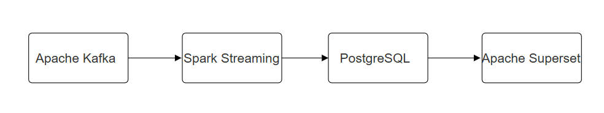
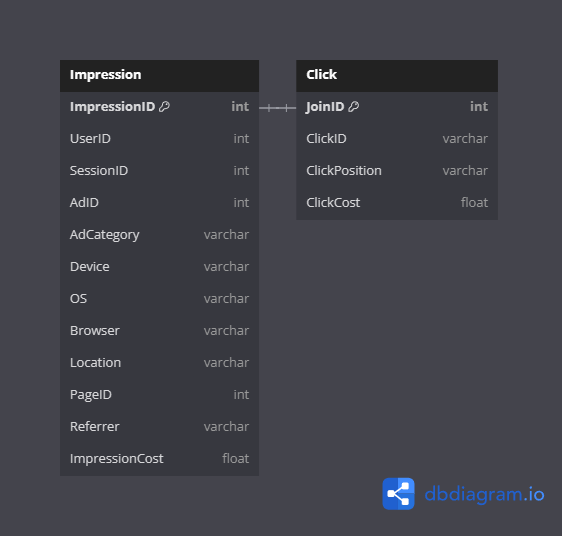

<h1 align="center">Real Time Data Analysis Project</h1>

Welcome to the Real Time Data Analysis Project - a robust, scalable, and real-time analytics solution designed to provide insightful dashboards and enhance business decisions. This project harnesses the power of Kafka, Spark Streaming, PostgreSQL, and Superset to process and visualize data as it arrives, giving you the ability to analyze trends and patterns instantaneously.

## Project Overview
At the heart of this project is a stream-stream join operation that combines data from two key tables in real time: impression and click. These tables capture user interactions and engagements with digital content in real-time, providing a comprehensive view of user behavior and advertisement performance.

## Data Architecture
Here is a flowchart of the data architecture. Various applications and platforms are implemented to create an end-to-end pipeline. \

\
Here are some applications used in the project:
* **Apache Kafka**: 
    * Distributed System: Kafka is run as a cluster on one or more servers that can span multiple datacenters. This provides high availability and redundancy.
    * Topic-based Publish-Subscribe Model: Kafka maintains feeds of messages in categories called topics. In this project, separate topics for impression and click events allow consumers to subscribe to the relevant data streams.
    * Scalability: It can scale easily without incurring downtime, handling millions of messages per second.
    * Durability and Reliability: Kafka replicates data and can support failure of nodes within the cluster.
    * Performance: High throughput for both publishing and subscribing. This means users can get real-time insights as data is produced and consumed continuously.
* **Spark Streaming**:
    * Handling Event-time and Watermarks: With the concept of event-time, Spark Streaming provides capabilities to handle the ordering of events as they are ingested from Kafka, which may not be in the exact order of their occurrence. Watermarks are used to specify how late the system is supposed to wait for the late events.
    * Fault Tolerance: Spark Streaming's checkpointing feature ensures stateful and fault-tolerant processing, automatically recovering from failures.
    * Advanced Analytics: Beyond just joining streams, Spark Streaming can perform a variety of complex operations such as windowing functions, aggregation, and stateful computations.
    * Integration with Kafka: Spark Streaming integrates well with Kafka to consume stream data. It can either pull data from Kafka at a high level using offsets or track the processed data using low-level API to provide exactly-once semantics.
    * Micro-batch Processing: Unlike traditional streaming systems that process one record at a time, Spark Streaming processes data in micro-batches, which can lead to better throughput and more efficient resource utilization.

* **PostgreSQL**:
    * Robust relational database management system.
    * Stores and manages the processed and joined data.
    * Supports complex queries needed for deep analytical insights.

* **Apache Superset**:
    * Modern data exploration and visualization platform.
    * Connects to PostgreSQL for data retrieval.
    * Enables the creation of interactive dashboards for real-time data analytics.

## Data Schema
**Table Structures**:

* **_df_impression_**: \
The df_impression table captures the details of ad impressions, which are instances where an ad is exposed to a potential customer. Each row in this table represents a unique ad impression event. The schema for this table is as follows:
    * ImpressionID: The primary key for the table, uniquely identifying each ad impression.
    * UserID: The identifier for the user who saw the impression.
    * SessionID: The identifier for the session during which the impression occurred.
    * AdID: The identifier for the specific ad that was shown.
    * AdCategory: The category or type of the ad (e.g., electronics, apparel).
    * Device: The type of device on which the ad was displayed (e.g., mobile, desktop).
    * OS: The operating system of the device.
    * Browser: The web browser used when the impression was served.
    * Location: The geographic location of the user when the ad was displayed.
    * PageID: The identifier for the web page where the ad was placed.
    * Referrer: The referrer URL if the user navigated from another site.
    * ImpressionCost: The cost associated with serving the ad impression.

* **_df_click_**: \
The df_click table provides details about the clicks that followed the ad impressions. Each row tracks a user's click on an ad. The structure of this table includes:
    * JoinID: The foreign key that references ImpressionID from the df_impression table, establishing a connection between an impression and a click.
    * ClickID: A unique identifier for each click event.
    * ClickPosition: The position or location on the page where the click occurred.
    * ClickCost: The cost attributed to the click.

**Key Metrics**: \
Using the provided schema, metrics such as Click-Through Rate (CTR), Cost Per Click (CPC), Cost Per Impression (CPI), Total Impressions, Total Clicks, and overall campaign costs. These metrics are critical for assessing the performance of online advertising efforts.
